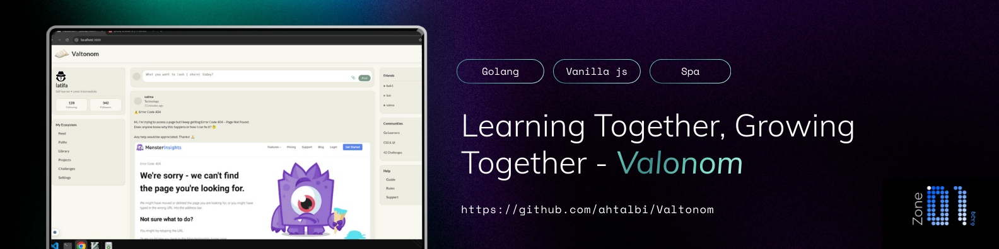

# Valtonom — Built for Autonomous Learners

During my journey at **Zone01 Oujda**, I completed a project called **Valtonom** — a community-driven platform designed for autonomous learners across all domains.

As a self-taught learner myself, I know how challenging it can be to learn independently. When you study on your own, it's not always easy to find people who share the same curiosity, interests, and motivation. Many of us are learning, experimenting, and growing — alone.

**That's the story behind Valtonom.**

Valtonom is a platform where self-taught learners can connect, share knowledge, exchange experiences, and grow together. The goal is to create a space where independent learners can find others like them — people who are learning by themselves but still want a community to progress with.

> *Valtonom is not just a project — it reflects the experience of many autonomous learners who want to learn independently, but not alone.*

---

## The Team

- **iaboudou**
- **ahtalbi**

---

## Getting Started

Open a terminal in the `backend/` folder and run the server:

```bash
cd backend
go run main.go
```

---

## Project Structure

```
.
├── backend
│   ├── config
│   ├── controllers
│   ├── db
│   ├── models
│   ├── pkg
│   └── routes
├── frontend
│   ├── assets
│   │   └── images
│   ├── packages
│   └── src
│       ├── events
│       ├── pages
│       │   ├── error
│       │   ├── home
│       │   ├── login
│       │   ├── messages
│       │   └── register
│       └── utils
└── README.md
```

- **`backend/`** — Go server, database initialization, controllers, and WebSocket logic.
- **`frontend/`** — Client-side UI built with a feature-based architecture (HTML/CSS/JS).

---

## About

Valtonom is a community-driven platform for autonomous learners across all domains. It brings together self-taught students who learn independently and grow by sharing knowledge, experiences, and resources.